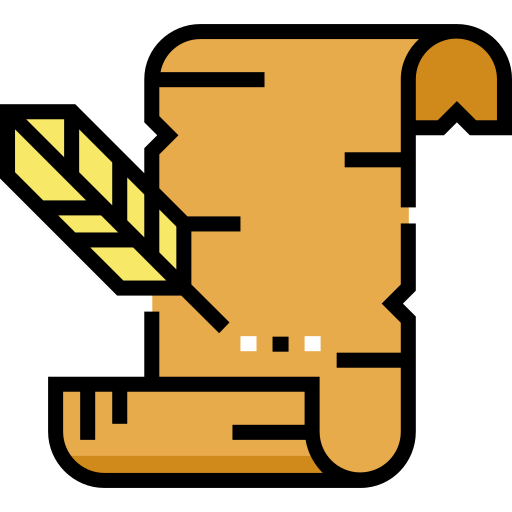
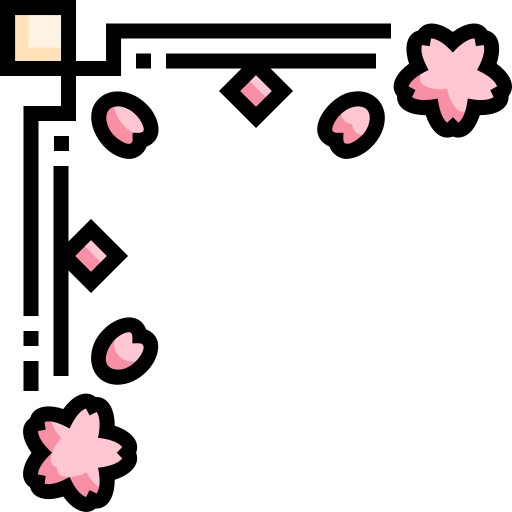
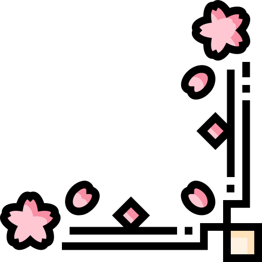

### Hi I'm Violette, welcome to my github profile!

 I love building projects. Developping useful and creative solutions is motivating, fun and challenging! 

## What am I looking for at the moment?

I'm currently looking for an apprenticeship in web developement for my bachelor year (bac +3)

## What do I love?
-  Arts
-  Books
-  History
-  Fantasy creatures
-  Video games
-  Music
-  Movies and theatre
-  Roleplay 

##  you can also find me here: 

   
Violette Pumkins#8327

<!--
**Violette-Pumkins/Violette-Pumkins** is a ✨ _special_ ✨ repository because its `README.md` (this file) appears on your GitHub profile.

Here are some ideas to get you started:

- 🔭 I’m currently working on ...
- 🌱 I’m currently learning ...
- 👯 I’m looking to collaborate on ...
- 🤔 I’m looking for help with ...
- 💬 Ask me about ...
- 📫 How to reach me: ...
- 😄 Pronouns: ...
- ⚡ Fun fact: ...
-->
